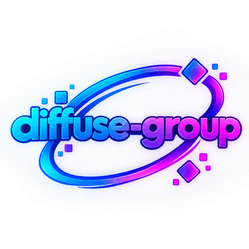

  

<h1 align="center">Diffusion-Group</h1>

  Practical Stable Diffusion tooling for the hardware you already own — 
  automatic GPU detection, verified downloads, zero-setup installs.

  
  
  
  

---

## Projects

### [AdaptDiffuse](https://github.com/jhfuheuiwfh/adaptdiffuse)

Plug-and-play Stable Diffusion engine with a clean Gradio WebUI. One double-click `launch.bat`, no environment to configure.

- **Runs on your GPU, not on a shopping list** — automatic cascade `NVIDIA CUDA → Vulkan → DirectML → CPU`, with ROCm(HIP) as an explicit option
- **sd-cli first** — one native binary ([stable-diffusion.cpp](https://github.com/leejet/stable-diffusion.cpp)), no PyTorch install
- **Verified downloads** — byte count and SHA-256 checked before anything executes; path-traversal archives rejected
- **Failures are explained** — built-in Diagnóstico panel plus `logs/backend.log` with step, exit code and message
- **Day-to-day use** — checkpoints, LoRA with scale, batch renders and presets in the WebUI

  <a href="https://github.com/jhfuheuiwfh/adaptdiffuse">Repository</a> ·
  <a href="https://github.com/jhfuheuiwfh/adaptdiffuse/releases/latest">Download</a> ·
  <a href="https://github.com/jhfuheuiwfh/adaptdiffuse#why-adapt-diffuse">Why AdaptDiffuse</a> ·
  <a href="https://huggingface.co/spaces/PedAI/Adapt-Diffuse">Live demo (SD 1.5, free ZeroGPU)</a>

## How we work

| Principle | What it means in practice |
|---|---|
| Verify before execute | size + SHA-256 on every binary and model we fetch |
| No silent failures | errors surface with exit code and log, never swallowed |
| Zero setup | one script to install, nothing to tune afterwards |
| Hardware-agnostic | old GPU, iGPU or no GPU — it still runs |

## Collaborating

Issues and pull requests are welcome on any public repository. Bug reports are most useful when they include the **Diagnóstico** output or `logs/backend.log`.

New ideas fit here too: inference backends, quantization recipes, UI polish, docs and translations.

---

  Diffusion-Group · open source, MIT licensed · built by <a href="https://github.com/jhfuheuiwfh">@jhfuheuiwfh</a>

